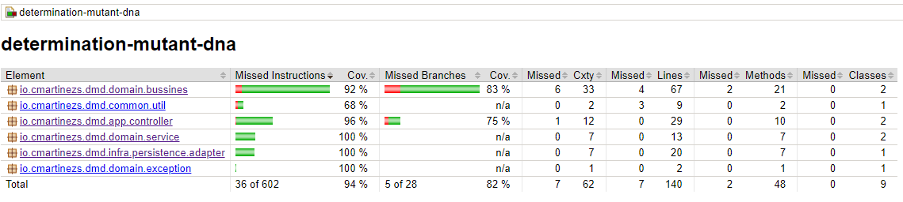
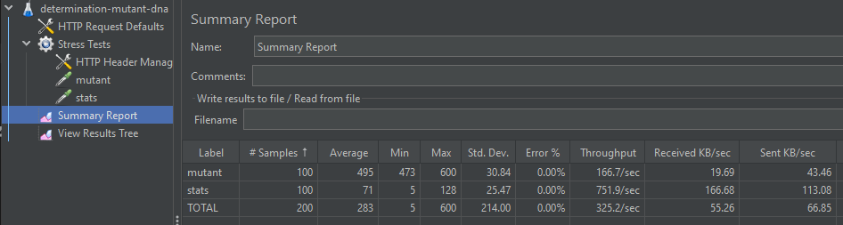
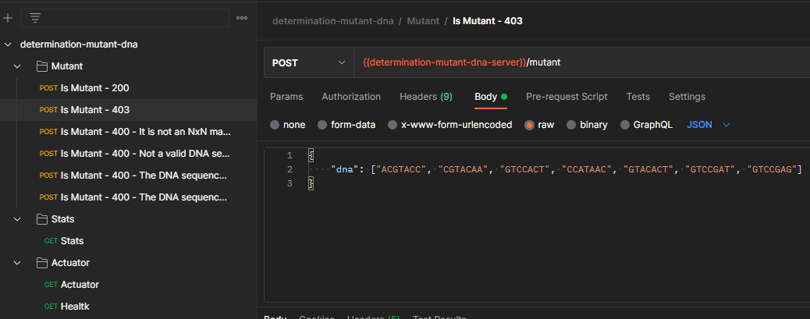
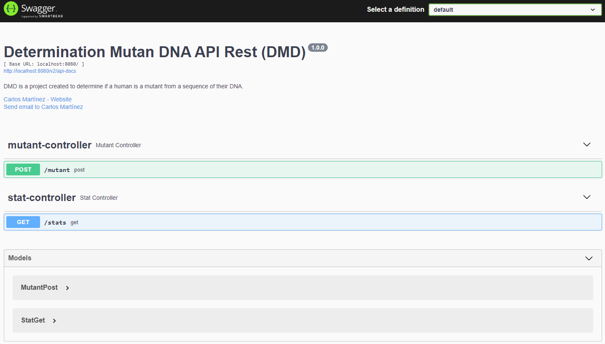

# DMD: Determination Mutant DNA
**DMD** is a project created to determine if a human is a mutant from a sequence of their _DNA_.

The program created for this project receives as a parameter an array of Strings that 
represent each row of a `NxN` table with the _DNA_ sequence. The letters of the Strings can only 
be: `A, C, G` and `T`, which represents each nitrogenous base of the _DNA_.

## Build and execution instructions

### Pre-requeriments

* JDK 11
* Maven
* JMeter (Optional)
* Postman (Optional)

### Unit tests and Jacoco coverage report
In the root folder run:
```bash
mvn clean test
```
The Jacoco coverage report is on the default path `build/reports/jacoco/test/html/index.html`



### JMeter test (optional)
In the root folder run:
```bash
mvn clean verify
```
The jmeter tests are done thanks to the maven plugin and the jmx file `src/test/jmeter/performance-tests.jmx` 
in the test folder. This file can be edited with the JMeter GUI.

For the execution of the stress tests it is also possible to do it through the JMeter GUI, opening the jmx file 
in the test folder


### Run on local environment
In the root folder run:
```bash
mvn spring-boot:run -Dspring-boot.run.jvmArguments="-DSPRING_PROFILE=local -DAPP_VERSION=1.0.0-M1"
```
**note**: This command executes the rest-api application locally available on port 8080

The environment variables used in for local execution are:
* `SPRING_PROFILE`: indicates the execution profile, which allows loading the properties file configured for a particular 
environment. In this project there are the `local` and `heroku` environments.
* `APP_VERSION`: indicates the version of the artifact to run.

The local environment uses an embedded database `H2`, which is started in memory every time the project is started. 
Configuration is automatic through the property `spring.jpa.properties.hibernate.hbm2ddl.auto`

### Cloud environment
This API is deployed on Heroku in the following url: https://determination-mutant-dna.herokuapp.com

For this environment an additional variable called `DATASOURCE_PASSWORD` is used to set the database password and 
the environment variable `SPRING_PROFILE` is configured with the value `heroku`.

The heroku environment uses a Mariabd database (own management), which already has the necessary table created 
to store the data. In this case it is not necessary to use automatic configuration. 

If you want to replicate your own database environment, use the following sql script, in addition to using the 
environment variable for password and modifying the necessary properties in the properties file.

#### Create table script
```sql
create table dna_sequences
(
    id         bigint auto_increment primary key,
    created_at datetime(6)  not null,
    md5        varchar(32)  not null,
    mutant     bit          not null,
    sequence   varchar(255) not null,
    constraint UK_MD5 unique (md5)
);
```
#### application-\<your profile name\>.yml
```yml
spring:
  datasource:
    url: <your jdbc url connection>
    username: <your username>
    password: ${DATASOURCE_PASSWORD}
    driver-class-name: <driver class-name for your db>
  jpa:
    properties:
      hibernate:
        enable_lazy_load_no_trans: true
        hbm2ddl:
          auto: none
        show_sql: false
        use_sql_comments: false
        format_sql: false
        dialect: org.hibernate.dialect.<dialect class for your db and version>
  sql:
    init:
      mode: never
```
**note**: You must add the dependency of your database driver to use

### Endpoints
The endpoints for the requested requirements are the following

* `/mutant`: determines if a DNA sequence corresponds to a mutant or not, answering `200 OK` in the affirmative 
case and `403 FORBIDDEN` in the negative case
* `/stats`: returns statistical information on the amount of mutant and human genes detected and their proportion 
relationship through the ratio

## Consume API

The following are the forms provided in the project to be able to consume the API
### Postman
The configuration files for the environments and execution of endpoints are available in the project using Postman

These files are located in the `postman` folder at the root of the project
* [Request collection for endpoints](/docs/postman/determination-mutant-dna.postman_collection.json)
* [Local environment](/docs/postman/Localhost.postman_environment.json)
* [Heroku environment](/docs/postman/Heroku%20Dev.postman_environment.json)

### Swagger
The Swagger library is used to generate a self-documentation page for the endpoints.

It can be accessed through the following urls:
* Local: http://localhost:8080/swagger-ui/#
* Heroku: https://determination-mutant-dna.herokuapp.com/swagger-ui/#